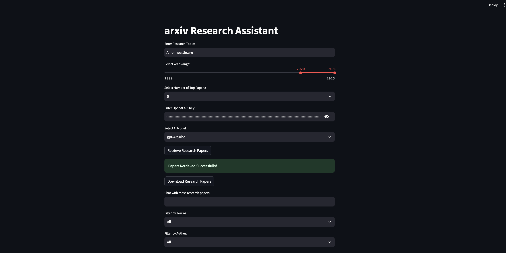

# Research-Paper-Assistant


## Overview
The **Research Paper Assistant** is a Streamlit-based application that allows users to retrieve the **top-cited research papers from arXiv**, process them using a **Retrieval-Augmented Generation (RAG) framework**, and interact with an **AI-powered chatbot** (GPT-4 Turbo via Azure OpenAI). The chatbot answers queries based on the retrieved papers while providing **hyperlinked citations**.


## Features
- **Fetch top research papers** from arXiv based on user queries.
- **Filter papers** by year range, journal, and author.
- **Store papers in a vector database** using FAISS for efficient retrieval.
- **Interact with an AI chatbot** powered by OpenAI's `gpt-4-turbo` model.
- **Cite research sources** with superscript hyperlinks in chatbot responses.
- **User input for OpenAI API key** to ensure secure and customizable API access.

## Technologies Used
- **Python**
- **Streamlit** (UI framework)
- **LangChain** (RAG-based document retrieval & AI chat)
- **Azure OpenAI (GPT-4 Turbo)** (LLM for chatbot interactions)
- **FAISS** (Vector database for paper embeddings)
- **arXiv API** (Paper retrieval)
- **Hugging Face Embeddings** (Document embedding for retrieval)

## Installation & Setup

### Requirements
Ensure you have Python installed (>=3.8). The required dependencies are listed in requirements.txt. Install them using:

```pip install -r requirements.txt```


### Prerequisites
Ensure you have Python installed (>=3.8). Install required dependencies:

```bash
pip install streamlit langchain langchain_community openai faiss-cpu pydantic arxiv
```

### Running the Application
1. **Clone the repository**:
   ```bash
   git clone https://github.com/yashgaur04/Research-Paper-Assistant.git
   cd Research-Paper-Assistant
   ```

2. **Run the Streamlit app**:
   ```bash
   streamlit run streamlitUI.py
   ```

3. **Enter your OpenAI API Key** when prompted.
4. **Search for research papers** and start interacting with the AI chatbot!

## Usage Guide
1. **Enter a research topic** (e.g., "Deep Learning in Healthcare").
2. **Select a year range** for paper retrieval.
3. **Choose the number of papers to fetch** (5, 10, 25).
4. **Enter your OpenAI API Key** (Required for AI chatbot interaction).
5. **Retrieve & filter papers** (by journal, author, or search within papers).
6. **Ask the chatbot questions**, and it will generate responses with citations.

## Testing
Unit tests are provided in `arxivFetch.py` using `unittest`. Run tests with:
```bash
python -m unittest arxivFetch.py
```

## Alternative Vector Databases
If FAISS is not working as expected, you can switch to **ChromaDB** by modifying `store_papers_in_vector_db` in `arxivFetch.py`:
```python
from langchain_community.vectorstores import Chroma
vector_db = Chroma.from_documents(documents, embeddings)
```

## Future Updates
- Adding multi-model functionality to include different models.
- Improving runtime for faster retrieval and chatbot response.
- Ability to download papers from Google Scholar in addition to arXiv.

## Contributing
Pull requests are welcome. For major changes, please open an issue first to discuss.

## License
This project is licensed under the **Apache 2.0 License**.


